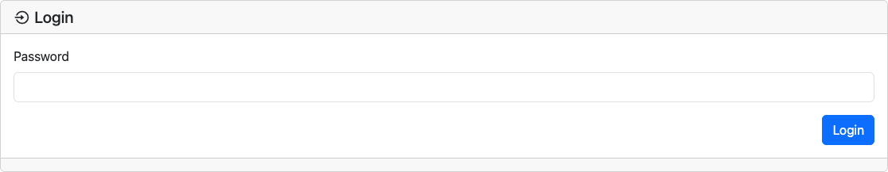
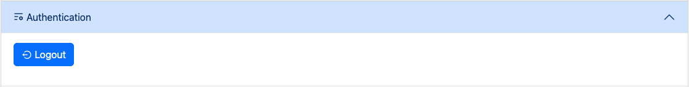

# Authentication

> **Note**
> The following page is based on version `1.0.0` of BrickTracker.

> **Warning**
> This is a lightweight access control feature and does not provide any strong layer of security to the application.

By default, every feature of the application is available.
Although it does not support individual accounts, it is possible to protect every "dangerous" feature under a password.
This can be useful if you want other people to access your inventory of sets in a "read-only" fashion.

To set up the authentication, you need to set the two following environment variables:

- `BK_AUTHENTICATION_KEY`: a secret for the server to encrypt the session cookie. See [.env.sample](../.env.sample) for how to generate the value
- `BK_AUTHENTICATION_PASSWORD`: the actual password

> **Warning**
> The password is stored in **plaintext**. Be mindful.

Once the authentication is set up, you should see a  pill on the right side of the menu bar.

If you click on it, or if you try to access a page requiring authentication, you will not be greeted with a login prompt.

Once authenticated the pill will switch to .

## Login out

If you need to log out, click the  pill.
Then press the **Logout** button in the Admin page.

## Features require authentication

If set up, the following will require an authentication:

- Sets
    - Add
    - Bulk add
    - Delete
    - Change status
    - Change the amount of missing parts
- Instructions
    - Upload
    - Rename
    - Delete
- Wishlist
    - Add
    - Delete
- Admin
