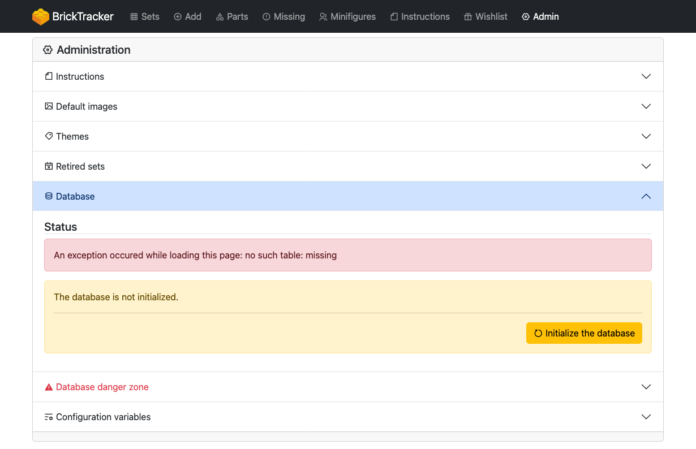

# First steps

> **Note**
> The following page is based on version `1.1.1` of BrickTracker.

## Database initialization

Once the application is running and you can access it, you should be greated with an error message.
This is perfectly normal as you are running the application for the first time and you need to initialize the database.

Click the **Administration** button to access the administration panel.
The **Database** section should be opened by default.

Press the **Initialize the database** button.

## Themes initialization

To have the themes identifier resolved into names, you need to do an initial update of the file.
Open the **Themes** section.
You will see an error message, this is expected.

Press the **Update the themes file** button to download an initial version of the themes file.

If everything went well you should see no more error message and some counters.

## Add a set

> **Important**
> Make sure you have set up your Rebrickable API key (`BK_REBRICKABLE_KEY`) for this to work (see [common errors](common-errors.md)).

> **Important**
> If you are using the CORS allowed origin restriction (`BK_DOMAIN_NAME`), make sure it is matching your application URL (see [common errors](common-errors.md)).

Use the menu bar to navigate to the **Add** page, make sure the socket is in a **connected** state.

Input a set number in the **Set number** field and press the **Add** button.
You can either use the set number (e.g `608`) and it will automitcally assume that you want version `1` (e.g `608-1`),
or you can use the complete number with the version (e.g `608-2`)

It will load information about the set you are about to add, but not add it yet.

Use the **Confirm add** button to add the set, or the **Dismiss** button if it is not the one you wanted.

> **Note**
> If you do not want to go through the confirmation process, check the **Add without confirmation** checkbox and the
> set will be added when you press the **Add** button.

If everything goes well you should see a **Success** message with a direct link to your set.

## Learn more

Consult the rest of the files in the [docs](.) folder.
