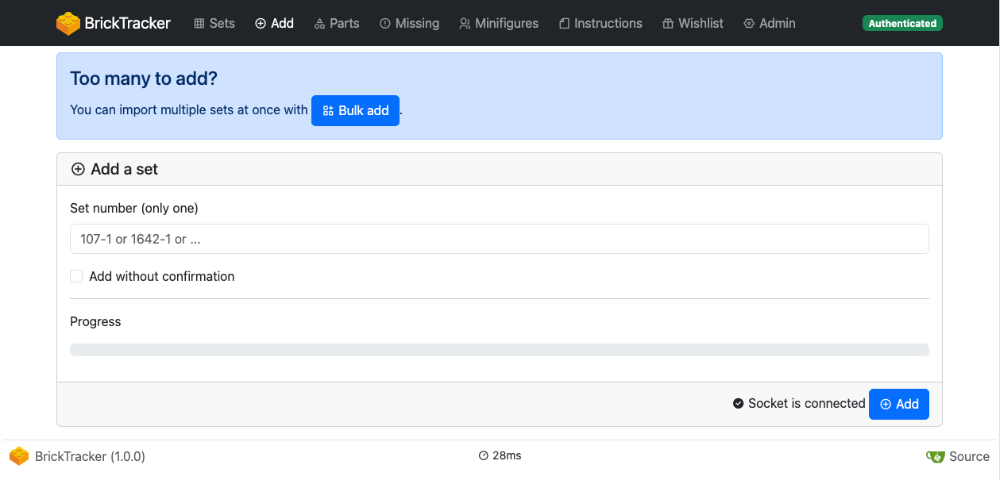

# BrickTracker

> **Note**
> The following page is based on version `1.0.0` of BrickTracker.

## Frontpage

If you are using `BK_RANDOM`, a random selection of sets and minifigures.
Otherwise, the latest added sets and minifigures.

You can click the card name or image to access a set or minifigure detail.

## Sets

> **Info**
> This does not do any pagination and loads **everything**. It can be slow depending on how many sets you have.

Displays all your sets, with quick look at theme, year, parts, missing parts, minifigures count and status.
You can search, filter and sort the grid. The sort order will be stored in a cookie and re-use on next page load.

You can click the card name or image to access a set detail.

### Multiple sets

Each added set has a unique ID and you can have multiple copies of the same set added to your inventory.

## Set details

Gives you more detail about a specific set, including instructions and parts list.

## Minifigure details

Gives you generic detail about a minifigure across all your sets.

## Part details

Gives you generic detail about a part across all your sets.

## Add

If you are authenticated, lets you add a new set to your inventory.
See [first steps](first-steps.md).

### Bulk add

If you need to add many sets at once, you can use the bulk add tool.
Instead of a set number, it takes a comma separated list of set numbers.
It will then process each number of the list sequentially as if you were doing it yourself one by one.
If an error occur, it will put back in the input field the list of number that were not processed.

## Parts

> **Info**
> This does not do any pagination and loads **everything**. It can be slow depending on how many sets you have.

Lists all your parts with details on quantity missing, number of sets missing it, number of minifigures missing it.
You can sort columns, and search the table.

Clicking on a part image will open it fullscreen.
Clicking on a part name will load its details.

## Missing (parts)

> **Info**
> This does not do any pagination and loads **everything**. It can be slow depending on how missing parts you have.

Lists all your missing parts with details on total quantity, quantity missing, number of sets using it, number of minifigures using it.
You can sort columns, and search the table.

Clicking on a part image will open it fullscreen.
Clicking on a part name will load its details.

## Minifigures

> **Info**
> This does not do any pagination and loads **everything**. It can be slow depending on how many minifigures you have.

Lists all your minifigures with details on quantity missing, number of missing parts, number of sets using it.
You can sort columns, and search the table.

Clicking on a minifigure image will open it fullscreen.
Clicking on a minifigure name will load its details.

## Instructions

> **Info**
> This does not do any pagination and loads **everything**. It can be slow depending on how many instructions you have.

Lists all your instructions and if they are matching a existing set, will display its name and image.
If you are authenticated, you can upload new instruction files, rename existing ones or delete them.
You can sort columns, and search the table.

Clicking on a set image will open it fullscreen.

## Wishlist

> **Info**
> This does not do any pagination and loads **everything**. It can be slow depending on how many wished sets you have.

Lists all your wished with details on theme, year, parts and *unofficial* retirement date.
If you are authenticated, you can add new wished sets or delete existing ones.
You can sort columns, and search the table.

Clicking on a set image will open it fullscreen.
